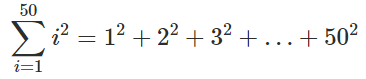
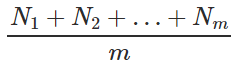
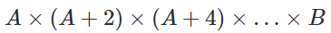
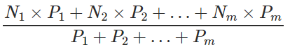

## Lista 3

* [Acumuladores](#Acumuladores) 
* [Repetições com Desvios](#Repetições-com-Desvios) 
* [Desafios](#Desafios)

### Acumuladores

#### (0) Exercício 47
Faça um programa Pascal que calcule o valor da soma dos quadrados dos primeiros 50 inteiros positivos não nulos e imprima o resultado do cálculo na tela. Observe que este programa não tem entrada, apenas saída.

#### (1) Exercício 49
Uma agência governamental deseja conhecer a distribuição da população do país por faixa salarial. Para isto, coletou dados do último censo realizado e criou um arquivo contendo, em cada linha, o salário de um cidadão particular. Os salários variam de zero a 19.000,00 unidades da moeda local.

Considere o salário mínimo igual a 450,00 unidades da moeda local.

As faixas salariais de interesse são as seguintes:

- de 0 a 3 salários mínimos
- de 4 a 9 salários mínimos
- de 10 a 20 salários mínimos
- acima de 20 salários mínimos.

Faça um programa Pascal que leia uma sequência de números reais, que será terminado em zero. O zero não deve ser processado e serve para terminar o programa. O programa deve imprimir na tela os percentuais da população para cada faixa salarial de interesse.

Exemplo:

|Entrada 1|Saída Esperada 1|
|:-------:|:--------------:|
|240.99 2720.77 4560.88 19843.33 834.15 315.87 5645.80 150.33 2560.00 2490.05 0.00|40.00 30.00 20.00 10.00|

#### (2) Exercício 50
Faça um programa Pascal que, dados dois números inteiros positivos, imprima quantas vezes o primeiro divide exatamente o segundo. Se o primeiro não divide o segundo o número de vezes é zero. Por exemplo, 72 pode ser dividido exatamente por 3 duas vezes. Use operadores inteiros apenas.

Exemplo:

|Entrada 1|Saída Esperada 1|
|:-------:|:--------------:|
|72 3|2|

#### (3) Exercício 52
Faça um programa Pascal que leia do teclado um número inteiro m e em seguida uma sequência de n números reais. Imprima a média aritmética inteira deles.

|Entrada|Saída Esperada|
|:-------:|:--------------:|
|2 2 4|3|
|5 8 9 6 5 7|7|

#### (4) Exercício 48
Faça um programa Pascal que leia do teclado dois números positivos ímpares A e B onde (A <= B) e calcule o produto dos números ímpares de A até B.
Isto é, calcule:

Imprima "erro" caso o número lido não satisfaça as condições. Caso contrário imprima o resultado do cálculo.

|Entrada|Saída Esperada|
|:-------:|:--------------:|
|3 5|15|
|7 15|135135|

#### (5) Exercício 46
Faça um programa Pascal que leia do teclado um conjunto de números onde cada linha contém dois valores numéricos sendo o primeiro do tipo real e o segundo do tipo inteiro. O segundo valor é o peso atribuído ao primeiro valor. O programa deve calcular e imprimir a média ponderada dos diversos valores lidos. A última linha de dados contém os números zero. Esta linha não deve ser considerada no cálculo da média e serve apenas para marcar o final da entrada de dados.

Isto é, calcular o seguinte, supondo que m linhas foram digitadas:

Imprima o resultado com duas casas decimais.

|Entrada|Saída Esperada|
|:-------:|:--------------:|
|60 1 30 2 40 3 0 0|40.00|

### Repetições com Desvios

#### (7) Exercício 54
Faça um programa Pascal que leia uma sequência de números reais terminada em 0 que representam a medida dos lados de um polígono e imprima "SIM" se ele é um polígono regular (todos os seus lados iguais) e "NAO" caso contrário.

Note que um polígono precisa ter ao menos 3 lados para ser um polígono O número zero serve para indicar o final da entrada de dados e não deve ser processado.

Exemplos:

|Entrada|Saída Esperada|
|:-------:|:--------------:|
|1 2 3 0|NAO|
|4 4 4 4 0|SIM|
|4 4 0|NAO|

#### (8) Exercício 61
Faça um programa Pascal que leia um número inteiro positivo N do teclado. Depois disso, o programa deve calcular e imprimir todos os arranjos de dois números inteiros positivos A, B, ambos menores que N, de forma que quando somados (A + B), resultam no número N. Cada arranjo A, B deve ser impresso em uma linha de saída.

Exemplos:

|Entrada|Saída Esperada|
|:-------:|:--------------:|
|7|1 6 2 5 3 4 4 3 5 2 6 1|

#### (9) Exercício 62
Faça um programa Pascal que receba uma sequência de números reais terminada em zero representando o saldo bancário de alguns clientes de um banco e imprima aqueles que são negativos. O valor zero serve para indicar o final da entrada de dados e não deve ser processado.

Exemplos:

|Entrada|Saída Esperada|
|:-------:|:--------------:|
|832.47 215.25 -1987.11 19.00 -45.38 0|-1987.11 -45.38|

#### (10) Exercício 57
Faça um programa Pascal que leia do teclado uma quantidade arbitrária de números inteiros positivos terminada em zero e identifique o maior múltiplo de 7 (sete) entre esses números. Depois da leitura dos dados, o maior múltiplo de 7 encontrado deve ser impresso. O número zero serve para indicar o final da entrada e não deverá ser processado.

Exemplos:

|Entrada|Saída Esperada|
|:-------:|:--------------:|
|4 8 3 63 99 41 28 99 65 0|63|
|739 805 568 382 490 51 719 403 240 152 0|805|

#### (11) Exercício 55
Faça um programa Pascal que leia dois números n e outro m (0 <= n <= 9) e conte quantos dígitos n existem em m. Se não existir nenhum dígito correspondente, a mensagem "NAO" deve ser exibida. Caso contrário imprima o resultado do seu cálculo.

Exemplos:

|Entrada|Saída Esperada|
|:-------:|:--------------:|
|9 95949|3|
|1 2353|NAO|

#### (12) Exercício 56
Faça um programa Pascal que leia dois números inteiros, um n e outro m. Seu programa deve imprimir a soma de todos os números pares entre n e m; sendo que, n e m não devem ser incluídos na soma.

Exemplos:

|Entrada|Saída Esperada|
|:-------:|:--------------:|
|2 8|10|
|0 6|6|

### Desafios

#### (15) Exercício 53
Faça um programa Pascal que leia do teclado um valor x inteiro e imprima o menor número N inteiro cujo fatorial N! seja maior que o valor informado.

Por exemplo, se for fornecido o valor 1000, o programa deve informar na tela o valor 7, pois 7! = 5040, e 6! = 720.

Exemplo:

|Entrada|Saída Esperada|
|:-------:|:--------------:|
|1000|7|
|100|5|
