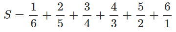
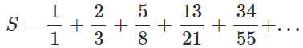
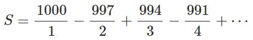
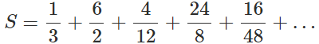
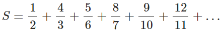
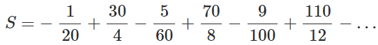

## Lista 5

* [Series](#Series)
* [Desafios](#Desafios)

### Series

#### (0) Series 002
Faça um programa em Pascal que lê do teclado um número inteiro positivo N. Depois disso, o programa deve calcular e imprimir a soma de todas as frações em que a soma do numerador com o denominador de cada fração seja o número N.

Por exemplo, se N=7, o programa deve calcular a soma abaixo:



a saída com duas casas decimais.
```
Exemplo:
Entrada 1:
7
Saída Esperada 1:
11.15

Entrada 2:
4
Saída Esperada 2:
4.33
```

#### (1) Series 003
Observe a soma infinita abaixo. Ela é formada por frações em que cada numerador é a soma entre o numerador e o denominador da fração anterior e cada denominador, por sua vez, é a soma do seu numerador com o denominador da fração anterior (exceto a primeira fração).



Faça um programa em Pascal que calcula o valor de S, considerando apenas os 5 primeiros termos da série. Ao final, imprimir o resultado encontrado para S com duas casas decimais.

#### (2) Series 001
Faça um programa em Pascal que leia um inteiro positivo n, e escreva a soma dos n primeiros termos da série abaixo:



Imprima a saída com duas casas decimais.
```
Exemplo:
Entrada 1:
2
Saída Esperada 1:
501.50

Entrada 2:
4
Saída Esperada 2:
585.08
```

#### (3) Series 005
Observe a soma infinita abaixo. Ela é formada por frações em que cada numerador é o dobro do denominador da fração anterior e cada denominador, por sua vez, é o dobro do numerador da fração anterior (exceto a primeira fração).



Faça um programa em Pascal para calcular o valor de S, considerando apenas os 10 primeiros termos da série. Ao final, imprimir o resultado encontrado para S com duas casas após a vírgula.

#### (4) Series 004
Observe a soma infinita abaixo. Ela é formada por frações em que o numerador e o denominador são os valores sucessores dos valores do numerador e do denominador da frações anterior, porém, alternadamente invertidos (exceto a primeira fração).



Faça um programa em Pascal para calcular o valor de S, considerando apenas os 10 primeiros termos da série. Ao final, imprimir o resultado encontrado para S com 2 casas após a vírgula.

### Desafios

#### (7) Series 007
A soma infinita indicada abaixo é composta de termos em que o numerador de cada termo é um número ímpar ou a dezena de um número ímpar, conforme a posição do termo na série, e o denominador é um número par ou a dezena de um número par, conforme a posição do termo na série:



Observe que o sinal de soma e subtração se alterna conforme a posição do termo na série.

Faça um programa em Pascal para calcular o valor de S, considerando apenas os 10 primeiros termos da série. Ao final, imprimir o resultado encontrado para S, com duas casas decimais.
