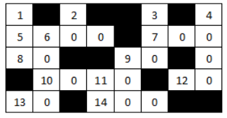

## Lista 10

* [Registros](#Registros)

### Registros

#### (0) Damas
Uma matriz D(8 × 8) pode representar a posiçao atual de um jogo de damas, sendo que 0 indica uma casa vazia, 1 indica uma casa ocupada por uma peça branca e -1 indica uma casa ocupada por uma peça preta. Supondo que as peças pretas estão se movendo no sentido crescente das linhas da matriz D, determinar as posições das peças pretas que:

• podem tomar peças brancas;
• podem mover-se sem tomar peças brancas;
• não podem se mover.

A prioridade na ação é sempre tomar uma peça, ou seja, em uma situação na qual uma peça preta possa tanto "mover" quanto "tomar", esta peça é marcada como "tomar". Cada peça só pode ser marcada com uma ação.

Para este exercício, considere que as peças pretas nunca estarão na última linha do jogo (dama). Caso não ocorra peça para algum dos movimentos possíveis exibir o valor 0 (zero) ao invés da posição.

|Exemplo de Entrada|Saída Esperada|
|----------------|------------|
|-1  0 -1  0 -1  0 -1  0<br> 0 -1  0 -1  0 -1  0 -1<br>-1  0 -1  0 -1  0 -1  0<br>0 0 0 0 0 0 0 0<br>0 0 0 0 0 0 0 0<br>0 1 0 1 0 1 0 1<br>1 0 1 0 1 0 1 0<br>0 1 0 1 0 1 0 1|tomar: 0<br>mover: 3-1 3-3 3-5 3-7<br>ficar: 1-1 1-3 1-5 1-7 2-2 2-4 2-6 2-8|
|-1 0 -1 0 -1 0 -1 0<br>0 -1 0 -1 0 -1 0 -1<br>0 0 -1 0 -1 0 -1 0<br>0 -1 0 0 0 0 0 0<br>0 0 1 0 0 0 0 0<br>0 1 0 0 0 1 0 1<br>1 0 1 0 1 0 1 0<br>0 1 0 1 0 1 0 1|tomar: 4-2<br>mover: 2-2 3-3 3-5 3-7<br>ficar: 1-1 1-3 1-5 1-7 2-4 2-6 2-8|

#### (1) Equações Lineares com Matrizes
Um vetor real X com n elementos é apresentado como resultado de um sistema de equações lineares Ax = B cujos coeficientes são representados em uma matriz real A(m×n) e os lados direitos das equações (os resultados de cada equação) em um vetor real B de m elementos. Criar um programa em Free Pascal que verifique se o vetor X é realmente solução do sistema dado, imprimindo "sim" caso o vetor informado seja solução do sistema de equações, ou imprimindo "não" caso contrário.

Dica: Comparações entre números reais pode ser um problema dependendo da arquitetura da máquina a ser utilizada. Para solucionar este problema um método a ser utilizado é a comparação por margem de erro.

PS: O sistema apresentado no exemplo de entrada é representado pela seguinte equação. 

```
2x + y - 3z = -1
-x + 3y + 2z = 12
3x + 1y - 3z = 0
```

|Exemplo de Entrada|Saída Esperada|
|----------------|------------|
|3 3 (tamanho da matriz)<br>1 3 2 (resultado informado)<br>2 1 -3 (Matriz)<br>-1 3 2<br>3 1 -3<br>-1 12 0 (lado direito)|sim|

#### (2) Palavras Cruzadas
Um jogo de palavras cruzadas pode ser representado por uma matriz A(n × m) onde cada posição da matriz corresponde a um quadrado do jogo, sendo que 0 indica um quadrado em branco e -1 indica um quadrado preto. Colocar as numerações de início de palavras horizontais e/ou verticais nos quadrados correspondentes (substituindo os zeros), considerando que uma palavra deve ter pelo menos duas letras.

PS: A imagem abaixo representa visualmente a matriz de entrada do exemplo. As palavras sempre são adicionadas da esquerda para a direita (Horizontal) ou de cima para baixo (Vertical). 



|Exemplo de Entrada|Saída Esperada|
|----------------|------------|
|5 8<br>0 -1 0 -1 -1 0 -1 0<br>0 0 0 0 -1 0 0 0<br>0 0 -1 -1 0 0 -1 0<br>-1 0 0 0 0 -1 0 0<br>0 0 -1 0 0 0 -1 -1|1 -1 2 -1 -1 3 -1 4<br>5 6 0 0 -1 7 0 0<br>8 0 -1 -1 9 0 -1 0<br>-1 10 0 11 0 -1 12 0<br>13 0 -1 14 0 0 -1 -1|

#### (3) Quadrado Mágico 1
Dizemos que uma matriz quadrada inteira é um quadrado mágico se a soma dos elementos de cada linha, a soma dos elementos de cada coluna e a soma dos elementos das diagonais principal e secundária são todos iguais. Exemplo:

```
| 8  0  7 |
| 4  5  6 |
| 3 10  2 |
```
é um quadrado mágico pois 8+0+7 = 4+5+6 = 3+10+2 = 8+4+3 = 0+5+10 = 7+6+2 = 8+5+2 = 3+5+7 = 15.

Crie um programa em Free Pascal que leia um valor n representando o tamanho da matriz e leia uma matrix A(n x n) que representa o quadrado e informe se a matriz é um quadrado mágico.

|Exemplo de Entrada|Saída Esperada|
|----------------|------------|
|3<br>8 0 7<br>4 5 6<br>3 10 2|sim|

#### (4) Quadrado Mágico 2
Seguindo o racíocinio do exercício sobre quadrado mágico. Crie um programa em Free Pascal que leia um inteiro n que representa o tamanho do lado de uma matriz A e uma matriz A(n x n) que representa o quadrado e imprima quantas matrizes não triviais (isto é, não pode ser a matriz que é constituida por apenas um elemento, uma linha e uma coluna) formam um quadrado mágico a partir da matriz fornecida.


|Exemplo de Entrada|Saída Esperada|
|----------------|------------|
|2 7 6 6 7 2<br>9 5 1 1 5 9<br>4 3 8 8 3 4<br>4 9 2 2 9 4<br>3 5 7 7 5 3<br>8 1 6 6 1 8|5|
