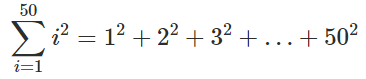

## Lista 3

* [Acumuladores](#Acumuladores) 
* [Repetições com Desvios](#Repetições-com-Desvios) 
* [Desafios](#Desafios)

### Acumuladores

#### (0) Exercício 47
Faça um programa Pascal que calcule o valor da soma dos quadrados dos primeiros 50 inteiros positivos não nulos e imprima o resultado do cálculo na tela.
Observe que este programa não tem entrada, apenas saída.

#### (1) Exercício 49
#### (2) Exercício 50
#### (3) Exercício 52
#### (4) Exercício 48
#### (5) Exercício 46

### Repetições com Desvios

#### (7) Exercício 54
#### (8) Exercício 61
#### (9) Exercício 62
#### (10) Exercício 57
#### (11) Exercício 55
#### (12) Exercício 56

### Desafios

#### (15) Exercício 53
