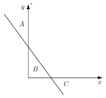

## Primeira Prova

Aqui estão dispostos os enunciados de provas antigas.<br>
As resoluções estão nesta mesma pasta.

* [2019/1](#20191)
* [2018/2](#20182)
* [2018/1](#20181)

### 2019/1

<b>Questão 1:</b> (10  pontos)  Calcule  quantos  litros  um  carro  consumiu  numa  determinada viagem.  Para isso, leia 3 valores, o primeiro corresponde a quantos km/l o carro faz, o segundo é o tempo de viagem (h) e o terceiro a velocidade média (km/h).  Imprima o resultado na tela.

<b>Questão 2:</b> (30 pontos) Escrever um programa que leia as coordenadas (x, y) de um ponto no plano cartesiano. Após, determine e imprima uma mensagem informado se este ponto pertence à região A, à região B, à região C, ou a nenhuma das regiões, conforme a figura abaixo. Considere que a equação da reta é 2x + y = 4. Considere também que a reta e os eixos não fazem parte das regiões A, B e C.



<b>Questão 3:</b> (60 pontos) A conjectura de Collatz, também conhecido como problema 3x + 1, pode ser sumarizado assim: Para qualquer inteiro positivo N, se N é par, divida N por 2 para obter N/2. Mas se N é impar, então multiplique N por 3 e some 1, para obter 3N + 1. Repita este processo indefinidamente. A conjectura estabelece que, não importa qual o número N que foi usado para iniciar o processo, sempre vamos atingir o número 1, eventualmente.<br>
  Usando a regra acima e tomando como exemplo a entrada 13, vamos gerar a seguinte sequência: 
```
13 --> 40 --> 20 --> 10 --> 5 --> 16 --> 8 --> 4 --> 2 --> 1
```
  Podemos ver que esta sequência particular, que começou com 13 e finalizou em 1, contém 10 termos. Apesar de isto nunca ter sido provado ainda (é o problema Collatz), se imagina que qualquer número de entrada termina em 1.<br>
  Faça um programa em Free Pascal que leia um número natural N e imprima na tela o número de termos requeridos para se chegar em 1. No caso do exemplo acima, a resposta seria 10.

### 2018/2

<b>Questão 1:</b> (20  pontos) O programa em Pascal abaixo contém erros de lógica. Ele deveria calcular e imprimir o valor de S como a soma das parcelas da seguinte série:
```
S = 1/100 + 2/99 + 3/98 + 4/97 + ... + 100/1
```
Corrija os erros do programa para que ele funcione tal como esperado.
```Pascal
programa SomaParcelas;

var
  S: real;
  num: integer;

begin
  S := 0;
  num := 0;
  while num < 100 do
  begin
    S := S + num/(100 - num);
    num := num + 1;
  end;
  writeln('O valor de S = ', S);
end.
```

<b>Questão 2:</b> (40  pontos) Por definição, dois números inteiros positivos de dois algarismos são chamados de pares combinados se ambos são pares e os dígitos de um ocorrem na ordem inversa do outro. Seu programa deve ler vários conjuntos de teste. A primeira linha de um conjunto de teste contém um inteiro não negativo, N, que indica quantos pares de números serão testados. A seguir o seu programa lê N linhas com pares de números cada um deles tendo dois algarismos. O programa deve verificar se eles são pares combinados e, se forem, imprimir "Sim". Se não forem, imprimir "Nâo". Veja o exemplo abaixo:

|Entrada|Saida|
|-------|-----|
|3| |
|48 84|Sim|
|23 32|Nao|
|13 31|Nao|

<b>Questão 3:</b> (40  pontos) A definição de "amplitude" em Estatística é dada pela grandeza numérica resultante da diferença entre o maior e o menor valor do conjunto de valores de uma amostra. Escreva um programa em linguagem Pascal para ler, a partir do teclado, uma sequência com uma quantidade arbitrária de valores reais positivos. A sequência termina com o valor 0 (que não faz parte dela). Os valores da sequência podem vir em qualquer ordem. O programa deve determinar e imprimir o valor da amplitude estatística dos valores. Por exemplo, considere a entrada de dados abaixo:
```
Entrada:
4.5 5.2 1.7 1.3 1.9 2.2 8.3 9.1 5.4 0 <ENTER>
Saída:
Amplitude = 7.8
```

### 2018/1

<b>Questão 1:</b> (50  pontos) Dados três números naturais n, i e j, imprimir em ordem crescente os n primeiros naturais que são múltiplos de i ou de j, ou de ambos.

Exemplo: para n = 6, i = 2 e j = 3, a saída deverá ser:
```
0, 2, 3, 4, 6, 8
```

<b>Questão 2:</b> (50  pontos) Qualquer número natural de quatro algarismos pode ser dividido em duas dezenas formadas pelos seus dois primeiros e dois últimos dígitos.

Exemplos:
- 1297: 12 e 97.
- 5314: 53 e 14.

Escreva um programa que lê uma sequência de números inteiros de 4 algarismos. Para cada número, imprime SIM se a raiz quadrade de tal número é a soma das dezenas formadas pela divisão acima, e imprime NÃO caso contrário. O programa deve terminar quando ler o número zero.

Exemplo de execução:
```
> 9801
SIM // pois raiz de 9801 = 99 = 98 + 01
> 2025
SIM // pois raiz de 2025 = 45 = 20 + 25
> 1024
NAO // pois raiz de 1024 = 32 <> 10 + 24
> 1025 
NAO // pois raiz de 1025 = 32,015 <> 10 + 25
> 0
(termina a execução)
```

