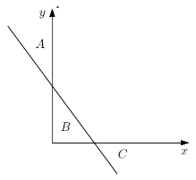
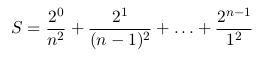
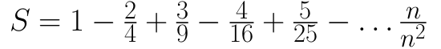

## Primeira Prova

Aqui estão dispostos os enunciados de provas antigas.<br>
As resoluções estão nesta mesma pasta.

* [2019/1](#20191)
* [2018/2](#20182)
* [2018/1](#20181)
* [2017/1](#20171)
* [2016/1](#20161)
* [2015/2](#20152)
* [2015/1](#20151)
* [2014/2](#20142)

### 2019/1

<b>Questão 1:</b> (10  pontos)  Calcule  quantos  litros  um  carro  consumiu  numa  determinada viagem.  Para isso, leia 3 valores, o primeiro corresponde a quantos km/l o carro faz, o segundo é o tempo de viagem (h) e o terceiro a velocidade média (km/h).  Imprima o resultado na tela.

<b>Questão 2:</b> (30 pontos) Escrever um programa que leia as coordenadas (x, y) de um ponto no plano cartesiano. Após, determine e imprima uma mensagem informado se este ponto pertence à região A, à região B, à região C, ou a nenhuma das regiões, conforme a figura abaixo. Considere que a equação da reta é 2x + y = 4. Considere também que a reta e os eixos não fazem parte das regiões A, B e C.



<b>Questão 3:</b> (60 pontos) A conjectura de Collatz, também conhecido como problema 3x + 1, pode ser sumarizado assim: Para qualquer inteiro positivo N, se N é par, divida N por 2 para obter N/2. Mas se N é impar, então multiplique N por 3 e some 1, para obter 3N + 1. Repita este processo indefinidamente. A conjectura estabelece que, não importa qual o número N que foi usado para iniciar o processo, sempre vamos atingir o número 1, eventualmente.<br>
  Usando a regra acima e tomando como exemplo a entrada 13, vamos gerar a seguinte sequência: 
```
13 --> 40 --> 20 --> 10 --> 5 --> 16 --> 8 --> 4 --> 2 --> 1
```
  Podemos ver que esta sequência particular, que começou com 13 e finalizou em 1, contém 10 termos. Apesar de isto nunca ter sido provado ainda (é o problema Collatz), se imagina que qualquer número de entrada termina em 1.<br>
  Faça um programa em Free Pascal que leia um número natural N e imprima na tela o número de termos requeridos para se chegar em 1. No caso do exemplo acima, a resposta seria 10.

### 2018/2

<b>Questão 1:</b> (20  pontos) O programa em Pascal abaixo contém erros de lógica. Ele deveria calcular e imprimir o valor de S como a soma das parcelas da seguinte série:
```
S = 1/100 + 2/99 + 3/98 + 4/97 + ... + 100/1
```
Corrija os erros do programa para que ele funcione tal como esperado.
```Pascal
programa SomaParcelas;

var
  S: real;
  num: integer;

begin
  S := 0;
  num := 0;
  while num < 100 do
  begin
    S := S + num/(100 - num);
    num := num + 1;
  end;
  writeln('O valor de S = ', S);
end.
```

<b>Questão 2:</b> (40  pontos) Por definição, dois números inteiros positivos de dois algarismos são chamados de pares combinados se ambos são pares e os dígitos de um ocorrem na ordem inversa do outro. Seu programa deve ler vários conjuntos de teste. A primeira linha de um conjunto de teste contém um inteiro não negativo, N, que indica quantos pares de números serão testados. A seguir o seu programa lê N linhas com pares de números cada um deles tendo dois algarismos. O programa deve verificar se eles são pares combinados e, se forem, imprimir "Sim". Se não forem, imprimir "Nâo". Veja o exemplo abaixo:

|Entrada|Saida|
|-------|-----|
|3| |
|48 84|Sim|
|23 32|Nao|
|13 31|Nao|

<b>Questão 3:</b> (40  pontos) A definição de "amplitude" em Estatística é dada pela grandeza numérica resultante da diferença entre o maior e o menor valor do conjunto de valores de uma amostra. Escreva um programa em linguagem Pascal para ler, a partir do teclado, uma sequência com uma quantidade arbitrária de valores reais positivos. A sequência termina com o valor 0 (que não faz parte dela). Os valores da sequência podem vir em qualquer ordem. O programa deve determinar e imprimir o valor da amplitude estatística dos valores. Por exemplo, considere a entrada de dados abaixo:
```
Entrada:
4.5 5.2 1.7 1.3 1.9 2.2 8.3 9.1 5.4 0 <ENTER>
Saída:
Amplitude = 7.8
```

### 2018/1

<b>Questão 1:</b> (50  pontos) Dados três números naturais n, i e j, imprimir em ordem crescente os n primeiros naturais que são múltiplos de i ou de j, ou de ambos.

Exemplo: para n = 6, i = 2 e j = 3, a saída deverá ser:
```
0, 2, 3, 4, 6, 8
```

<b>Questão 2:</b> (50  pontos) Qualquer número natural de quatro algarismos pode ser dividido em duas dezenas formadas pelos seus dois primeiros e dois últimos dígitos.

Exemplos:
- 1297: 12 e 97.
- 5314: 53 e 14.

Escreva um programa que lê uma sequência de números inteiros de 4 algarismos. Para cada número, imprime SIM se a raiz quadrade de tal número é a soma das dezenas formadas pela divisão acima, e imprime NÃO caso contrário. O programa deve terminar quando ler o número zero.

Exemplo de execução:
```
> 9801
SIM // pois raiz de 9801 = 99 = 98 + 01
> 2025
SIM // pois raiz de 2025 = 45 = 20 + 25
> 1024
NAO // pois raiz de 1024 = 32 <> 10 + 24
> 1025 
NAO // pois raiz de 1025 = 32,015 <> 10 + 25
> 0
(termina a execução)
```

### 2017/1

<b>Questão 1:</b> (35  pontos) Considere a série definida como a soma de termos abaixo.  



Escreva um programa em Pascal que leia a quantidade de termos n e escreva o valor de S.

<b>Questão 2:</b> (35  pontos) Dizemos que um número i é congruente módulo m a j se o resto da divisão inteira de i por m é igual ao resto da divisão inteira de j por m. Por exemplo: 35 é congruente módulo 4 a 39, pois 35 MOD 4 = 3 = 39 MOD 4.

Escreva um programa Pascak que leia inteiros positivos n, j e m, e imprima os n primeiros naturais congruentes a j módulo m.

Exemplo de execução
```
Entrada:
5 3 100
Saída:
1 3 100
4 3 100
7 3 100
10 3 100
13 3 100
```

<b>Questão 3:</b> (30  pontos) Uma sequência contígua de números inteiros iguais, onde o valor anterior e posterior desta sequência são menores ou maiores, é chamada de planalto. Dada uma sequência de números inteiros, terminada por zero, faça um programa que informe a quantidade de planaltos existentes nesta sequência.

Por exemplo, para a seguinte sequência,
```
5 5 5 4 1 -1 -1 -1 8 9 9 8 8 9 1 3 8 8 7 6 6 6 6 0
```
o programa deve imprimir 6.

### 2016/1

<b>Questão 1:</b> (35  pontos) Todo mês, os pais de Chiquinho depositam R$50 para ele em uma caderneta de poupança. Além disso, todo ano ele recebe R$200 de sua madrinha como presente de aniversário (em maio) e R$300 de seus avós no Natal, que também são depositados na mesma poupança.

Considerando que a caderneta de poupança rende 0.5% ao mês e que os depósitos começaram agora, escreva um programa em Pascal para calcular em quantos anos e meses a caderneta de poupança de Chiquinho terá mais de R$20000. A saída deverá indicar o saldo final e o tempo necessário para alcançá-lo, na forma:
```
Saldo: R$20075.30 obtido em 8 anos e 9 meses.
```
Importante: primeiro acrescente os juros sobre o saldo do mês anterior e depois faça o(s) depósito(s) do mês corrente.

<b>Questão 2:</b> (35  pontos) Escreva um programa em Pascal que receba dois números naturais a e b do teclado e verifica se b corresponde aos últimos digitos de a. Em caso afirmativo, seu programa deve imprimir a mensagem ENCAIXA. Caso contrário, deve imprimir NAO ENCAIXA. Exemplos:
```
567890 890 -> ENCAIXA
1243 1243 -> ENCAIXA
2457 245 -> NAO ENCAIXA
457 2457 -> NAO ENCAIXA
```

<b>Questão 3:</b> (30  pontos) Uma sequência de n números inteiros não nulos é dita piramidal k-alternante se é constituída por k segmentos: o primeiro com um elemento, o segundo com dois elementos e assim por diante até o k-ésimo, com k elementos.

Além disso, os elementos de um mesmo segmento devem ser todos pares ou todos ímpares e para cada segmento, se seus elementos forem todos pares (ímpares), os elementos do segmento seguinte devem ser todos ímpares (pares).

Por exemplo, a sequência com n = 10 elementos é piramidal 4-alternante:
```
12 3 7 2 10 4 5 13 5 11
```
A sequência com n = 3 elementos é piramidal 2-alternante:
```
7 10 2
```
A sequência com n = 8 elementos não é piramidal alternante pois o último segmento não tem tamanho 4:
```
1 12 4 3 13 5 12 6
```
Escreva um programa em Pascal que dado um inteiro n, (n >= 1) e uma sequência de n números inteiros, verifica se ela é piramidal k-alternante. Se for, o programa deve imprimir o valor de k. Senão, deve dar a resposta NAO.

### 2015/2

<b>Questão 1:</b> Ler 2 inteiros e determinar se a soma dos digitos do primeiro é igual ao valor do segundo. Por exemplo, dados 86 e 14, temos 8 + 6 = 14. Por outro lado, dados 234 e 10, temos 2 + 3 + 4 <> 10.

<b>Questão 2:</b> Ler uma sequência de números inteiros terminada por 0 (zero) e determinar o tamanho da maior sequência de números pares encontrada. Por exemplo, para a sequência de entrada 9 3 8 6 12 4 1 8 88 7 98 12 14 7 0, o resultado seria 4 (que corressponde ao tamanho da sequência 8 6 12 4). O valor final (0) não deve ser considerado.

### 2015/1

<b>Questão 1:</b> (20  pontos)
Um comerciante quer dar duas categorias de desconto para seus produtos: ou de 30% ou de 40%. A vitrine de sua loja apresenta sempre os produtos com preço ORIGINAL, sem desconto. Se o produto custa (sem desconto) menos de R$ 87,00 (oitenta e sete reais), o desconto será de 30%, senão o desconto será de 40$.

Para definir o preço COM desconto, o comerciante define primeiro, secretamente, o preço de cada mercadoria já considerando o desconto. Devido a isso, o seu problema passou a ser o de determinar o preço original de cada mercadoria para divulgar na vitrine.

Escreva um programa em linguagem Pascal que permite ler, a partir do teclado, um número Real positivo representando o preço COM DESCONTO de uma única mercadoria. O programa deve calcular e imprimir o preço a ser anunciado da mercadoria, de acordo com o que foi descrito anteriormente. Veja os exemplos abaixo. Note que pequenas aproximações menores do que um centavo podem ser adotadas pelo programa.
```
./preço_original
Digite o preço com o desconto: 51.37
O preço original para 30% é: 73.39

./preço_original
Digite o preço com o desconto: 55.42
O preço original para 30% é: 92.37
```

<b>Questão 2:</b> (40  pontos) Um número de Keith é um número inteiro, superior a 9, tal que os seus algarismos, ao começarem uma sequência de Fibonacci (formada por somas de 2-em-2 números, ou de 3-em-3, ou de 4-em-4, e assim por diante), alcançam posteriormente o referido número. Um exemplo é 47, porque a sequência de Fibonacci que começa com 4 e 7 (4, 7, 11, 18, 29, 47) alcança o 47. Outro exemplo, mas que possui três algarismos, é 197: 1 + 9 + 7 = 17, 9 + 7 + 17 = 33, 7 + 17 + 33 = 57, 17 + 33 + 57 = 107, 33 + 57 + 107 = 197. Alguns números de Keith conhecidos são: 14, 19, 28, 47, 61, 76, 197, 742, 1104, 1537, 2208, 2580, 3684, 4788, 7385, 7647, 7909, 31331, 34285.

Fazer um programa em linguagem Pascal capaz de ler do teclado um número inteiro positivo de apenas dois algarismos. O programa deve determinar se o número lido é um número de Keith ou não. Veja exemplos de execução abaixo:
```
./keith
Entre com o número: 61
Sim, eh um número de Keith.

./keith
Entre com o número: 45
Nao eh um número de Keith.
```

<b>Questão 3:</b> (40  pontos) Dizemos que uma sequência de inteiros é k-alternante se for composta alternadamente por segmentos de números pares de tamanho k e segmentos de números ímpares de tamanho k (ou na ordem ímpares-pares). Veja exemplos da definição:
```
A sequência 1 3 6 8 9 11 2 4 1 7 6 8 é 2-alternante
A sequência 2 1 4 7 8 9 é 1-alternante
A sequência 4 2 3 1 6 4 2 9 não é alternante
A sequência 1 3 5 é 3-alternante
```
Fazer um programa em Pascal capaz de ler vários números inteiros positivos terminada por zero (o zero não faz parte da sequência k-alternante). O programa deve determinar se a sequência de números lidos é k-alternante ou não. Se for, o programa deve calcular e imprimir o valor de k dentro da frase "Sim, eh k-alternante". Caso contrário, deve ser impressa a mensagem "Nao eh alternante". Exemplos de entrada e saída são:
```
./eh_k_alternante
1 3 6 8 9 11 2 4 1 7 6 8 0 <ENTER>
Sim, eh 2-alternante

./eh_k_alternante
4 2 8 3 1 7 6 4 6 2 9 7 0 <ENTER>
Nao eh alternante
```

### 2014/2

<b>Questão 1:</b> (50  pontos) Um número inteiro positivo é dito triangular se seus valor é o produto de três números naturais consecutivos. Por exemplo, o número 120 ṕe triangular porque 120 = 4 * 5 * 6. Dado um número inteiro positivo n verificar se ele é triangular ou não. Se for, imprimir a mensagem "É triangular" e "Não é triangular", caso contrário.
```
./triangular
120 <ENTER>
É triangular

./triangular
123 <ENTER>
Não é triangular
```

<b>Questão 2:</b> (50  pontos) Considere a soma infinita das séries apresentadas abaixo:



Fazer um algoritmo que calcule o valor aproximado de S. A aproximação tem que se dar pelo truncamento da série de forma a considerar a seguinte condição: a norma da diferença entre duas parcelas consecutivas passa a ser menor que 10^-8. Ao final, imprimir o resultado encontrado para S.
