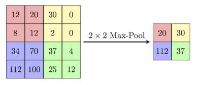

## Terceira Prova

Aqui estão dispostos os enunciados de provas antigas.<br>
As resoluções estão nesta mesma pasta.

* [2019/1](#20191)
* [2018/2](#20182)

### 2019/1

<b>Questão 1:</b> (40  pontos) Considere o tipo abstrato de dados Pilha e os protótipos das funções e procedimentos:
``` Pascal
CONST MAX = 100;
TYPE
    elemento = longint;
    pilha = record
        ini: longint;
        v: array [1..MAX] of elemento;
    end;
    
procedure inicializa_pilha (var p: pilha);
(* inicializa a estrutura *)

function pilha_vazia (p: pilha): boolean;
(* retorna true se a pilha esta vazia *)

procedure empilha (x: elemento; var p: pilha);
(* insere x no inicio da pilha *)

function desempilha (var p: pilha): elemento;
(* retorna o elemento do inicio da pilha e o remove dela *)

function topo (p: pilha): elemento;
(* retorna o elemento do inicio da pilha, sem remove-lo *)
```

Implemente um programa em Pascal que receba como entrada uma lista de números inteiros terminada em zero. O zero não deve ser processado e apenas indica que a entrada de dados terminou. Seu programa deve imprimir SIM caso a lista de números tenha pares bem formados de números de mesmo valor absoluto, sendo que o positivo ocorre sempre antes do seu respectivo negativo. Seu programa deve imprimir NAO em caso contrário. Apenas a tı́tulo de exemplo, caso os números fossem todos 1 e -1, isto poderia ser visto como parenteses abertos (1) e parênteses fechados (-1), representando uma expressão de parênteses corretamente balanceada. Não é necessário escrever os códigos das funções e procedimentos do TAD Pilha, considere que eles estão corretamente implementados em uma biblioteca. Apenas resolva o problema usando o TAD Pilha.

```
Exemplo 1:
1 2 3 4 -4 -3 5 6 -6 -5 -2 -1
SIM
Exemplo 2:
1 2 3 -1 -2 -3
NAO
```

<b>Questão 2:</b> (60  pontos) Considere que a partir de uma matriz podemos definir uma ampulheta como sendo feita de 7 células da seguinte forma:
```
A B C
  D
E F G
```
Por exemplo, a matriz seguinte:
```
2 3 0 0 0
0 1 0 0 0
1 1 1 0 0
0 0 2 4 4
0 0 0 2 0
```
Possui as seguintes 9 ampulhetas:
```
2 3 0   3 0 0   0 0 0
  1       0       0
1 1 1   1 1 0   1 0 0 

0 1 0   1 0 0   0 0 0
  1       1       0
0 0 2   0 2 4   2 4 4 

1 1 1   1 1 0   1 0 0
  0       2       4
0 0 0   0 0 2   0 2 0 
```
a soma dos elementos de cada uma das ampulhetas é:
```
9, 5, 1, 4, 8, 10, 3, 6 e 7
```
Faça um programa em Pascal que leia uma matriz de números inteiros de dimensão quadrada 0 ≤ N ≤ 100, e que imprima o maior valor da soma dos elementos dentre todas as ampulhetas desta matriz. 

Dado o exemplo acima a saı́da esperada do programa é:
```
10
```

### 2018/2

<b>Questão Única:</b> (100  pontos)

Polling é uma técnica utilizada em Redes Neurais Convolucionais (CNN’s) que reduz a dimensionalidade da imagem visando agrupar caracterı́sticas similares em uma única informação. A funcionalidade é similar a convolução, porém mais simples.

Uma variação é a MaxPooling que aplica um filtro de máxima para cada pedaço da imagem. A Figura 1 ilustra o processo. Neste caso o passo aplicado foi de tamanho 2, ou seja, é analizada uma área 2 × 2 que é saltada e nenhum elemento é novamente analizado. Uma outra possibilidade é que o passo seja de tamanho 1, assim a dimensão da imagem é reduzida somente em uma linha e uma coluna (ver exemplo de saı́da 2).



Faça um programa em Free Pascal que leia um tamanho N , 0 < N ≤ 1024, sendo N um número par e lê também qual o tamanho passo (1 ou 2). E que leia uma uma matriz quadrada N × N de números inteiros. O programa realiza uma operação de MaxPooling com o passo definido na matriz lida e imprime a matriz resultante. Montar as funções e/ou procedimentos necessários para a execução do programa.

```
Exemplo 1:

4
2
 12  20  30   0
  8  12   2   0
 34  70  37   4
112 100  25  12

Saída:
 20  30
112  37

Exemplo 2:
4
1
 12  20  30   0
  8  12   2   0
 34  70  37   4
112 100  25  12

Saída:
 20  30  30
 70  70  37
112 100  37
```
